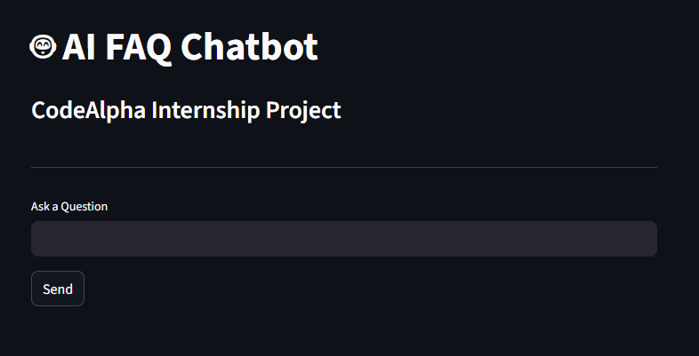

# 🤖 AI FAQ Chatbot

An AI-powered Frequently Asked Questions (FAQ) Chatbot built using **Python**, **Natural Language Processing (NLP)**, **TF-IDF Vectorization**, **Cosine Similarity**, and **Streamlit**.

The chatbot intelligently matches user questions with the most relevant FAQ and returns an appropriate response in real time.

This project was developed as part of the **CodeAlpha Artificial Intelligence Internship Program**.

---

## 🚀 Live Demo

🔗 **Try the Application Here**

https://your-app-name.streamlit.app

*(Add your deployed Streamlit or Hugging Face link here after deployment.)*

---

# ✨ Features

✅ Intelligent FAQ Matching

✅ Natural Language Processing (NLP)

✅ TF-IDF Vectorization

✅ Cosine Similarity-Based Response Generation

✅ Interactive Chat Interface

✅ Fast Response Time

✅ User-Friendly Design

✅ Easily Customizable FAQ Dataset

---

# 📸 Screenshots

## 🏠 Home Screen



---

## 💬 Chatbot Conversation


---

# 🛠️ Tech Stack

| Technology   | Purpose                   |
| ------------ | ------------------------- |
| Python       | Core Programming Language |
| Streamlit    | Frontend User Interface   |
| Pandas       | Dataset Processing        |
| Scikit-Learn | NLP & Similarity Matching |
| NLTK         | Text Processing           |
| CSV          | FAQ Knowledge Base        |

---

# 🧠 NLP Concepts Used

### TF-IDF (Term Frequency - Inverse Document Frequency)

Converts text into numerical vectors that represent the importance of words within the FAQ dataset.

### Cosine Similarity

Measures similarity between the user's question and stored FAQ questions.

### Intent Matching

The chatbot identifies the most relevant question and returns its corresponding answer.

---

# 📂 Project Structure

```text
CodeAlpha_FAQChatbot/
│
├── assets/
│   ├── home.png
│   └── chat.png
│
├── chatbot/
│   ├── __init__.py
│   └── faq_engine.py
│
├── data/
│   └── faq.csv
│
├── app.py
├── requirements.txt
└── README.md
```

---

# ⚙️ Installation

## 1️⃣ Clone Repository

```bash
git clone https://github.com/YOUR_USERNAME/CodeAlpha_FAQChatbot.git
```

---

## 2️⃣ Navigate to Project Directory

```bash
cd CodeAlpha_FAQChatbot
```

---

## 3️⃣ Install Dependencies

```bash
pip install -r requirements.txt
```

---

## 4️⃣ Run the Application

```bash
streamlit run app.py
```

The chatbot will automatically open in your browser.

---

# 📦 Required Libraries

```txt
streamlit
pandas
scikit-learn
nltk
```

---

# 🔄 How It Works

### Step 1

User enters a question.

Example:

```text
What are your working hours?
```

### Step 2

The chatbot preprocesses the input text.

### Step 3

TF-IDF converts all FAQ questions into numerical vectors.

### Step 4

Cosine Similarity calculates the similarity score between the user's question and stored FAQs.

### Step 5

The most relevant FAQ answer is returned.

Example:

```text
Our working hours are Monday to Friday from 9 AM to 6 PM.
```

---

# 📊 Example Questions

Try asking:

* What are your working hours?
* Where are you located?
* How can I contact support?
* Do you provide internships?
* What services do you offer?
* Can I work remotely?
* Do you provide certificates?

---

# 🎯 Future Improvements

* 🎤 Voice-Based Chatbot
* 🌎 Multi-Language Support
* 🔊 Text-to-Speech Responses
* 🤖 Integration with Large Language Models
* 📜 Chat History
* 🌙 Dark Mode
* ☁️ Database Integration
* 📄 Export Chat Conversations

---

# 📚 Learning Outcomes

Through this project I gained experience with:

* Natural Language Processing (NLP)
* TF-IDF Vectorization
* Cosine Similarity
* Information Retrieval Systems
* Streamlit Development
* Python Application Development
* Dataset Management
* AI Chatbot Design

---

# 🏆 Internship Information

### Organization

CodeAlpha

### Domain

Artificial Intelligence

### Task

Chatbot for FAQs

### Status

Completed Successfully ✅

---

# 👨‍💻 Author

## Akarsh Kumar

B.Tech Student | AI & Data Science Enthusiast

🔗 GitHub: https://github.com/YOUR_USERNAME

🔗 LinkedIn: https://linkedin.com/in/YOUR_LINKEDIN

---

# ⭐ Support

If you found this project useful, please consider giving it a ⭐ on GitHub.

Your support helps improve future projects and encourages open-source contributions.

---

## 📜 License

This project is developed for educational and internship purposes.

Feel free to fork, modify, and learn from it.
